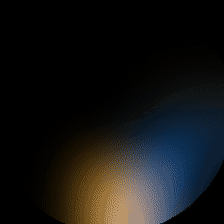
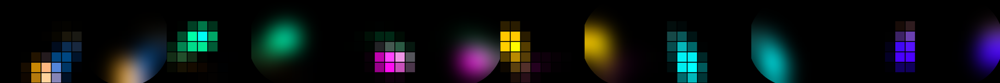
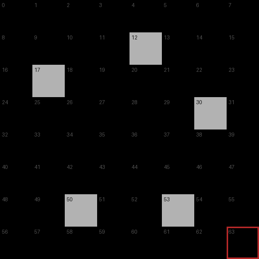
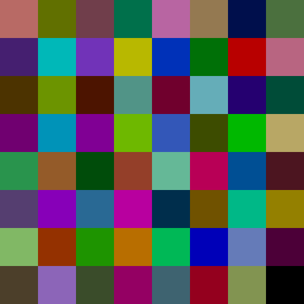

# lifx-ceiling-lab

Calibrate and animate a **LIFX Ceiling** (the round 8×8 matrix fixture) over
the LAN protocol. This is the code behind the "firefly in a ceiling" post:
a physics-simulated bouncing light with a comet trail, plus the calibration
patterns and tools used to model the diffuser, an image/GIF → 8×8 pipeline,
and a one-page local control widget.

<p align="center">
  
</p>

<p align="center">
  
</p>

No cloud, no tokens: the fixture speaks a binary UDP protocol on port 56700
to anything on your LAN. The core client is Python standard library only.

```bash
git clone https://github.com/silverdavi/lifx-ceiling-lab.git
cd lifx-ceiling-lab
pip install -e ".[examples,ui]"      # extras optional; core needs nothing
cp config.example.yaml config.yaml   # optional: pin your fixture IP/serial
lifx-play --frames examples/dynamic/frames/firefly.json --loop
```

`Ctrl-C` leaves the last frame showing; `lifx-play --restore-only` puts back
whatever the fixture displayed before.

## What's here

| Path | What |
| --- | --- |
| `src/lifx_ceiling/` | LAN client (stdlib only), frame schema, rotate/flip/uplight transforms, player, preview, image/GIF converters |
| `calibration/` | the two test patterns we photographed, the fitted default diffuser kernel, and tools to push patterns and fit your own kernel from a photo |
| `examples/static/` | hand-authored 8×8 Mario portraits + a minimal push script |
| `examples/dynamic/` | the firefly: physics generator and the baked 45 s / 900-frame loop |
| `examples/images/` | show any image or GIF on the fixture |
| `ui/` | local FastAPI server + one-page widget |
| `docs/protocol.md` | LAN protocol notes for the Ceiling, learned the hard way |
| `systemd/` | example unit to loop the firefly from an always-on LAN host |

## The firefly

`examples/dynamic/firefly.py` integrates a body under constant gravity inside
a **circular** arena (the fixture's visible area is a disc — a square box
would put the floor and corners off the glass), with 12 physics sub-steps per
frame splatted into a decaying accumulation buffer at 24× zone resolution for
real motion blur. Colour changes **only on wall contact**. Three details stop
it degenerating into a ball orbiting the rim: heavy tangential friction,
Gaussian scatter of each rebound, and a minimum-inward-angle floor (reflection
off a curved wall preserves grazing incidence, so a shallow arrival would
otherwise hug the rim forever).

The committed `frames/firefly.json` is reproducible byte-for-byte from the
default seed. Regenerate or reseed:

```bash
pip install -e ".[examples]"
python3 examples/dynamic/firefly.py            # same file, same bytes
python3 examples/dynamic/firefly.py --seed 7   # a different 45 seconds
```

Known limitation: the loop seam is visible — frame 900 does not match frame 0.

## Why streaming, not upload

The fixture cannot store animations. `Set64` writes the current pixel map and
returns; the only autonomous animations are the built-in firmware effects
(Morph / Flame / Sky, ≤16-color palettes). The official app's public API has
no create-scene endpoint either. So a LAN host streams ~20 packets/s while an
animation runs — see `docs/protocol.md` and `systemd/` for running it
persistently, and always "release" (power off + stop sending) before handing
control back to the LIFX app.

## Calibration

What the glass shows is the zone map convolved with the diffuser. We pushed
two patterns (five sparse white probes; 63 maximally-contrasting colours),
photographed the disc, and fitted a Gaussian point-spread of **σ ≈ 0.8
zones** with a visible aperture of **≈ 4.32 zones** radius. Those defaults
ship in `calibration/defaults/kernel.json` and are baked into the preview
tool and the firefly's arena size.

<p align="center">
  
  &nbsp;
  
</p>

```bash
python3 calibration/tools/push_pattern.py calibration/patterns/psf-sparse
# photograph the disc, then:
python3 calibration/tools/fit_from_photo.py photo.jpg --out my-kernel.json
```

Full walkthrough in `calibration/README.md`.

## Custom images

```bash
lifx-image cat.jpg /tmp/cat.json && lifx-play --frames /tmp/cat.json
lifx-gif nyan.gif /tmp/nyan.json && lifx-play --frames /tmp/nyan.json --loop
lifx-preview /tmp/preview.png --frames /tmp/cat.json --frame cat   # no socket
```

Images are downscaled to 8×8 **in linear light** (averaging in sRGB darkens
everything) with a small saturation boost — 64 zones behind a diffuser read
better slightly overdriven. For pixel-art GIFs, `lifx-gif` also has a crisp
grid-sampling mode; on an 8×8 display, hand-authored beats downsampled every
time (compare the `gif` portrait against the others in
`examples/static/mario_portrait.json`).

## The widget

```bash
pip install -e ".[ui]"
python3 ui/server.py     # http://127.0.0.1:8632
```

One page: firefly (changing colours or a single swatch, peak brightness
1–100 — it can be genuinely dim), your uploaded image or GIF, uplight-ring-only
mode, and **stop & release**, which powers off and goes silent so the LIFX
app has uncontested control. It binds to 127.0.0.1 and is deliberately not a
platform.

## Orientation

Protocol row 0 may not be "up" on your ceiling (ours was mounted 180° off).
Push a recognisable frame raw and rotate until it's right, then save it:

```bash
lifx-play --static face --rotate 0    # then try 90 / 180 / 270
```

Zone 63 is the **uplight ring**, not a visible pixel; every tool masks it
unless told otherwise. See `docs/protocol.md`.

## Privacy

Identifying values in this repo are structurally masked (`d073d5xxxxxx`,
`xxx.xxx.xxx.xxx`) — see `PRIVACY.md`. `scripts/check_secrets.py` gates
commits on no real serials/IPs in tracked files.

## License

MIT · [silverdavi](https://github.com/silverdavi)
